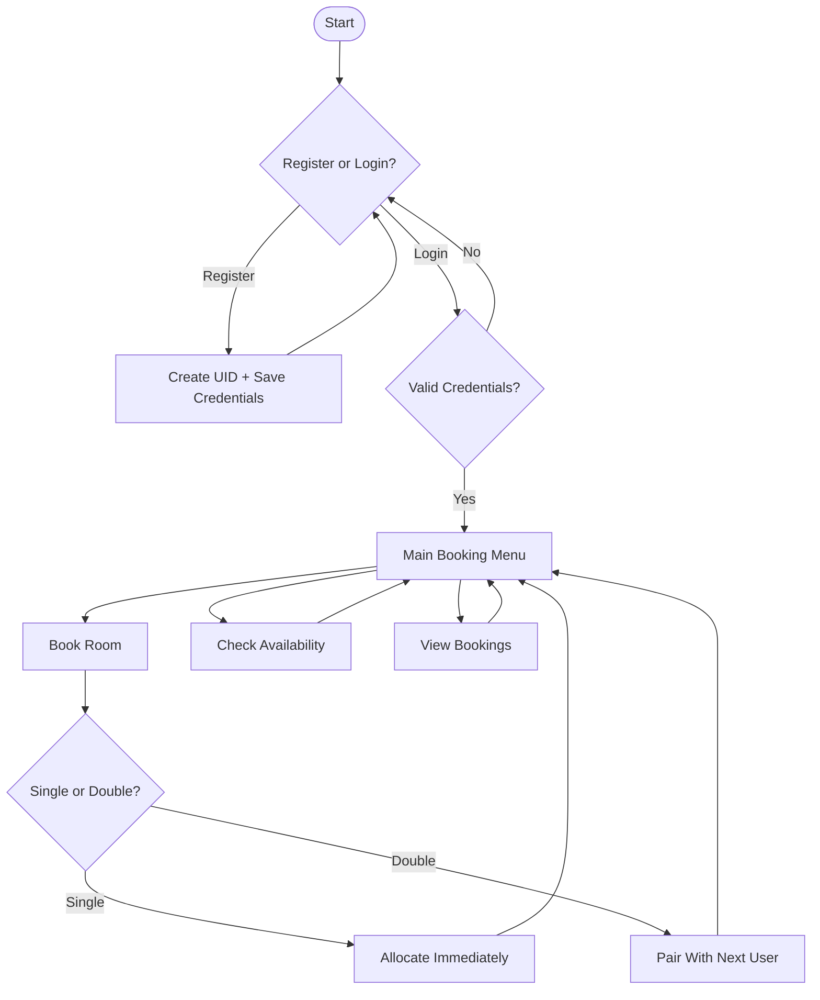

<div align="center">

# 🏨 Hostel Management System

### A sleek, menu-driven C++ console application for managing hostel registrations, room allocation, and bookings.


<br/>


</div>

---

## ✨ Overview

**Hostel Management System** is a lightweight, terminal-based application written in modern C++ that streamlines the day-to-day operations of running a hostel — from user registration and secure login, to room allocation and booking history, all backed by simple file storage so your data persists between runs.

No database setup, no dependencies — just compile and run.

---

## 🚀 Features

| 🔑 Feature | 📋 Description |
|---|---|
| **User Registration** | Create an account with a username and password; get a unique UID auto-generated for you |
| **Secure Login** | Authenticate using username, password, and UID before accessing the system |
| **Room Booking** | Book a **Single** or **Double** room — double rooms are smartly paired between two users |
| **Live Availability** | Instantly check how many single and double rooms are still open |
| **Booking History** | View a complete, persisted log of every booking ever made |
| **File-Based Storage** | All users and bookings are saved locally in plain text files — no external database needed |

---

## 🎬 Demo

<div align="center">

```
===== Hostel Management System =====
____________________________________________________________________________
1. Register
2. Login
3. Exit
Choice: 2

Login
Enter Username: arsh
Enter Password: ********
Enter UID: 1000

Login successful! (UID: 1000)
____________________________________________________________________________
1. Book Room
2. Check Availability
3. View Bookings
0. Exit
Choice: 1
Enter Room Type (single/double): single
Single room allotted!
Your Room Number is: S1
```

</div>

> 💡 Tip: Record a terminal session with a tool like [Terminalizer](https://terminalizer.com/) or [asciinema](https://asciinema.org/) and drop the GIF here for an even more attractive README!

---

## 🧠 How It Works



---

## 🛠️ Tech Stack

<div align="center">


</div>

- **Language:** C++ (Standard Library only — `iostream`, `fstream`, `vector`, `string`)
- **Design:** Object-Oriented — `user`, `AuthManager`, and `Manager` classes handle authentication and room logic separately
- **Persistence:** Plain-text files (`login.txt`, `users.txt`) act as a mini flat-file database

---

## 📂 Project Structure

```
HostelManagementSystem/
├── main.cpp        # Core application logic (auth, booking, menus)
├── login.txt        # Auto-generated — stores registered users
├── users.txt         # Auto-generated — stores room booking records
├── .gitignore
└── README.md
```

---

## ⚙️ Installation & Setup

### Prerequisites
- A C++ compiler ([g++](https://gcc.gnu.org/), Clang, or MSVC)

### 1. Clone the repository
```bash
git clone https://github.com/Arshhh26/HostelManagementSystem.git
cd HostelManagementSystem
```

### 2. Compile the program
```bash
g++ main.cpp -o hostel
```

### 3. Run it 🎉
```bash
./hostel        # Linux / macOS
hostel.exe      # Windows
```

---

## 🕹️ Usage Guide

1. **Register** — Choose option `1` from the main menu, pick a username & password, and note down your auto-generated **UID**.
2. **Login** — Choose option `2` and enter your username, password, and UID together.
3. **Book a Room** — From the booking menu, select room type:
   - `single` → allotted instantly
   - `double` → you'll be queued and paired with the next user requesting a double room
4. **Check Availability** — See real-time counts of remaining single & double rooms.
5. **View Bookings** — Browse the full history of allotted rooms and their occupants.

---

## 🗺️ Roadmap

- [ ] Password hashing for stronger security
- [ ] Admin dashboard to manage/cancel bookings
- [ ] Room deallocation / checkout support
- [ ] Migrate storage from flat files to SQLite
- [ ] Add unit tests

---

## 🤝 Contributing

Contributions are always welcome!

```bash
# 1. Fork the repo
# 2. Create your feature branch
git checkout -b feature/amazing-feature

# 3. Commit your changes
git commit -m "Add some amazing feature"

# 4. Push to the branch
git push origin feature/amazing-feature

# 5. Open a Pull Request
```

---

## 📜 License

This project is licensed under the **MIT License** — feel free to use, modify, and distribute it.

---

<div align="center">

### ⭐ If you found this project useful, consider giving it a star!


</div>
